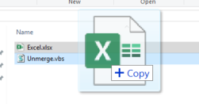
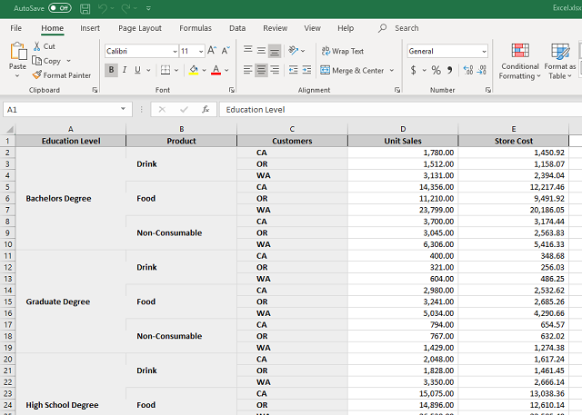
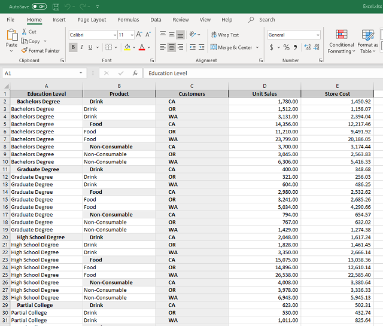

# Unmerge Excel File

Originally posted here:
https://www.codeproject.com/Tips/5287708/Unmerge-Excel-File

This script is useful if you want to Unmerge Excel File prior to importing it to a database.

## Introduction

Drag and drop an Excel file on top of VBS file to unmerge.

Before unmerge:

After unmerge:

## Using the Code

This script will unmerge merged ranges that are one cell wide and many rows deep.
